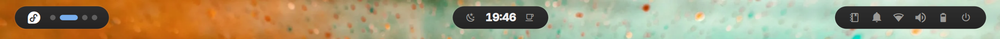

<div align="center">

# fd44_hyprdot

**Fedora 44 · Hyprland · Quickshell** — a complete desktop for the Framework 13 (AMD),
including the installer that builds the machine from bare metal.

<sub>
no display manager &nbsp;·&nbsp; no panel toolkit &nbsp;·&nbsp; no notification daemon &nbsp;·&nbsp; the shell is QML
</sub>

<p>


</p>

</div>

---

## Themes

Two palettes, switched live with `SUPER+T` or the sun/moon beside the clock.
The bar, frame, launcher, power menu, lock screen, kitty, GTK apps and Chromium
all follow — nothing restarts.

<table>
<tr>
<td width="50%" valign="top">

<p align="center"><sub><b>dark</b> — Adwaita dark</sub></p>
</td>
<td width="50%" valign="top">

<p align="center"><sub><b>cream</b> — Adwaita light</sub></p>
</td>
</tr>
</table>

A theme is one file of 47 key/value pairs in [`themes/`](themes/). `bin/theme.sh`
reads it and fans the values out to five consumers, each with its own idea of
what a config file is:

| target | mechanism | live? |
|---|---|---|
| quickshell | `Theme.qml` watches a generated palette with `FileView` | yes |
| kitty | generated `theme.conf` + `SIGUSR1` | yes |
| GTK apps | `gsettings` (colour scheme, icon theme), republished by xdg-desktop-portal | yes |
| Hyprland | `hyprctl eval` — **not** `keyword`, which the Lua parser refuses | yes |
| Chromium | `BrowserThemeColor` policy, written by a root service from a validated request, + `--refresh-platform-policy` | yes |
| hyprlock | generated colour variables it `source`s | next lock |

Adding a third theme means adding a file. Nothing else changes.

**Icons** are [Reversal](https://github.com/yeyushengfan258/Reversal-icon-theme)
(GPL-3.0): grey folders on dark, purple on cream, named by each theme's
`icon_theme` key, and the launcher's app icons too. It is opt-in - the desktop
is complete without it, and until it is installed GTK apps keep Adwaita's icons:

```sh
bin/icon-theme.sh            # ~275 MB on disk in ~/.local/share/icons, no root
bin/icon-theme.sh --status   # what the themes want vs what is installed
bin/icon-theme.sh --remove
```

It installs the colour sets the theme files name, from a pinned upstream
commit, so changing a theme's `icon_theme` and running it again is the whole
job of switching colours.

**Chromium** reads policy only from `/etc`, and that directory stays root's: a
theme switch writes just a colour and light/dark to `~/.local/state`, and a small
sandboxed root service checks it is exactly that and writes the one policy file.
Nothing running as you can set any other browser policy. The installer sets this
up; on a machine installed before it existed, run once:

```sh
sudo bin/chromium-policy-setup.sh            # --remove takes it out again
```

## What it gives you

<p align="center">
  
</p>

- **Bar** — workspaces, clock, theme toggle, and an OSD that slides out of the
  left pill for volume and brightness
- **Frame** — a 4px border drawn around the whole screen, with concave fillets
  where the panels meet it
- **Launcher** (`SUPER+Space`) — rises out of the bottom frame, fuzzy app search
- **Wallpaper** — drawn by quickshell itself, no wallpaper daemon; it
  crossfades when the choice changes, and `bin/wallpaper.sh set <file>` from a
  terminal fades in live too
- **Wallpaper picker** (`SUPER+,`) — a coverflow strip of sheared tiles
- **Settings** (`SUPER+SHIFT+,`, or click the logo) — a sidebar window over the
  desktop: theme, notification timeouts, launcher ranking, and a switch per bar
  plugin. Search finds a setting across every page
- **Power menu** (`SUPER+M` or the physical power button) — icon-only circles;
  log out, restart and shut down arm on the first press and fire on the second
- **Lock screen** — themed hyprlock, with battery
- **Media keys** — quickshell speaks MPRIS directly, so a media key spawns no
  process at all

## Install

The installer builds the whole machine: Btrfs + systemd-boot, optional LUKS,
Hyprland, quickshell, autologin, Plymouth. It asks for a dotfiles git URL —
give it this repo and the result is this desktop, not a generic one. It also
offers KDE Plasma instead of Hyprland; see **Plasma instead** below.

```sh
# from a Fedora Workstation live ISO
curl -O https://raw.githubusercontent.com/jccl1706/fd44_hyprdot/master/install/install_fedora.sh
chmod +x install_fedora.sh

./install_fedora.sh --check-repos   # resolve every package name, no root
sudo ./install_fedora.sh --dry-run  # print every command, change nothing
sudo ./install_fedora.sh            # the real thing
```

### Plasma instead

The installer asks which desktop to build, and the two are alternatives — it
never installs both.

| | Hyprland | KDE Plasma |
|---|---|---|
| Login | autologin on tty1, **no display manager** | SDDM |
| Terminal | kitty | konsole |
| Installed | the desktop this repo is for | **~2 GB, 412 packages** |

Plasma here is not the KDE suite. `plasma-desktop` and `plasma-workspace` with
SDDM are already 333 packages and 1 GB on their own — Plasma is simply large —
and what is added on top is the short list a laptop actually needs:

- **plasma-nm, bluedevil, kscreen, plasma-pa** — wifi, bluetooth, displays,
  volume. `plasma-systemsettings` is what makes them reachable as settings
  pages rather than only as panel applets.
- **breeze, breeze-gtk, breeze-icon-theme** — the GTK half is the compatibility
  one: GTK applications otherwise ignore the theme and arrive in Adwaita.
- **konsole, dolphin, kwrite, spectacle, okular, discover** —
  and `xdg-desktop-portal-kde`, so file pickers and screen sharing work outside
  KDE applications.

Left out: `kde-apps`, `kdepim`, `kate`, `elisa`, `kmail`, `akonadi`. None of
them is needed to log in and work.

Two things arrive that nobody asked for, and both are worth knowing before they
surprise you. **VLC** comes with the desktop: `phonon-qt6` needs a backend and
`phonon-qt6-backend-vlc` is the only one Fedora 44 ships, so there is nothing
to choose. And **Discover brings Flatpak** (~8 MB) as a backend, with no
remotes configured — Flathub is a decision for whoever sits at the machine. It
brings no PackageKit: Fedora's build talks to dnf and Flatpak directly, which
is not what the same application does elsewhere.

Every package name in **both** desktops is resolved by `--check-repos`, not
only the one a given run would install — a name checked only on the machine
that happens to pick that desktop is a name nobody checks.

Choosing Plasma changes nothing about the Hyprland path: autologin, the uwsm
hook in the shell profile and the session entry are all still written exactly
as before, and the verification pass checks whichever desktop was built.

---

It finishes with a verification pass — boot entries, fstab, autologin, the
font, the policy directory, the absence of packages that install themselves.
Twenty-seven always run; up to eight more depend on the choices made — LUKS
encryption and disk swap add two each, zram two, a laptop one
(`powerprofilesctl`), and Chromium as the browser one (its policy directory).

> **The account ships with the password `changeme`.** This is a public repo, so
> assume everyone knows it. That is safe only because `~/.bash_profile` refuses
> to start a session until the password has been changed. The password is
> deliberately **not** expired: `agetty --autologin` runs `login -f`, and PAM
> rejects an expired password on that path rather than prompting, which leaves
> the machine in a getty respawn loop that never reaches a desktop.

### Testing it without hardware

```sh
# 36 packages, ~162 MB. The two -x skip weak dependencies with no use here:
# an Intel QuickAssist daemon and a UEFI shell.
sudo dnf install -x qatlib-service -x edk2-shell-x64 \
                 qemu-system-x86-core qemu-img edk2-ovmf qemu-ui-gtk \
                 qemu-device-display-virtio-gpu qemu-device-display-virtio-vga-gl \
                 qemu-device-display-virtio-gpu-gl virglrenderer

install/vm-test.sh /path/to/Fedora-Workstation-Live-*.iso
```

Works on either machine (both have AMD-V and a GPU virgl can use). Serves this
directory over HTTP so the guest can `curl` the installer at `10.0.2.2:8000`,
and forwards host port 2222 to the guest's ssh. The target disk is `/dev/vda`.
`--reboot` boots the installed disk; `--clean` throws it away.

A full install with no questions to answer, inside the VM:

```sh
curl -O http://10.0.2.2:8000/install_fedora.sh && chmod +x install_fedora.sh
sudo ./install_fedora.sh --unattended --yes --desktop --disk /dev/vda \
     --dotfiles https://github.com/jccl1706/fd44_hyprdot
```

`--desktop` matters in a VM even for testing laptop changes: it turns off
encryption (the LUKS passphrase would be prompted for mid-install) and the 32G
swap partition, which a 40G test disk cannot spare.

### On a machine the installer did not build

`~/.config/hypr`, `~/.config/quickshell`, `~/.config/kitty` and the rest are
**symlinks** into this checkout, so edits are live and there is nothing to keep
in sync. `bin/link-dotfiles.sh` makes all of them and is safe to re-run: a link
that is already right is left alone, one pointing elsewhere is repointed, and a
real file or directory in the way is reported rather than replaced.

```sh
git clone https://github.com/jccl1706/fd44_hyprdot ~/Work/fd44_hyprdot
cd ~/Work/fd44_hyprdot

bin/link-dotfiles.sh --dry-run   # what it would link
bin/link-dotfiles.sh             # hypr, quickshell, kitty, tmux, starship,
                                 # wireplumber, and the ones this machine wants

systemctl --user restart wireplumber   # picks up wireplumber/ rules
systemctl --user daemon-reload && systemctl --user enable --now power-mode.service

sudo dnf install rsms-inter-vf-fonts jetbrains-mono-fonts google-noto-serif-vf-fonts \
                 liberation-sans-fonts liberation-serif-fonts liberation-mono-fonts
sudo bin/install-nerd-font.sh        # installs the copy committed in fonts/
bin/theme.sh restore                 # generate the palette files
```

## Keybindings

**[The full cheatsheet is in `docs/keybindings.md`](docs/keybindings.md)** — every
bind, grouped, with the reasoning. The same thing styled, for reading on the
machine and for printing, is [`docs/keybindings.html`](docs/keybindings.html)
(`xdg-open docs/keybindings.html`). The ones worth knowing without looking:

| Key | Action |
|---|---|
| `SUPER+Return` | terminal (kitty) |
| `SUPER+B` / `+E` / `+Y` | browser / file manager / YouTube in its own window |
| `SUPER+Space` | app launcher |
| `SUPER+,` | wallpaper picker |
| `SUPER+SHIFT+,` | settings |
| `SUPER+T` | toggle theme |
| `SUPER+Z` | focus mode — hide the bar to a single button |
| `SUPER+M` | power menu (also the physical power button) |
| `SUPER+W` / `+F` / `+V` / `+P` | close / fullscreen / float / pseudo-tile |
| `SUPER+J` | cycle column width |
| `SUPER+[` / `+]` | consume / expel a window from its column |
| `SUPER+A` | fit all — zoom out to the whole strip |
| `SUPER+arrows` | move focus (`+SHIFT` moves the window) |
| `SUPER+right-drag` / `+left-drag` | move / resize with the mouse |
| `SUPER+1..0` | focus workspace (`+SHIFT` sends the window) |
| `SUPER+Tab` | next workspace (`+SHIFT` previous) |
| `SUPER+S` | scratchpad (`+SHIFT` send) |
| ``SUPER+` `` | btop, floating, in its own scratchpad (needs `sudo dnf install btop`) |
| `SUPER+Escape` | passthrough — hand every key to the focused window, e.g. a VM |
| `Print` / `SUPER+SHIFT+P` | screenshot to clipboard: whole screen / a region |
| `SUPER+CTRL+P` | screenshot region to `~/Pictures/` |

Volume, brightness and media keys are bound with `locked = true`, so they keep
working on the lock screen.

> `SUPER+Escape` is a submap. While it is active **no other bind exists** — that
> is the point — so a stuck passthrough looks exactly like a broken keyboard.
> `hyprctl submap` says which is active; the same key gets you out.

## The wallpaper follows the sun

Four wallpapers and two palettes, anchored to sunrise and sunset rather than to
the clock:

| slot | from | to |
|---|---|---|
| morning | sunrise − 30m | sunrise + 2h |
| day | sunrise + 2h | sunset − 90m |
| evening | sunset − 90m | sunset + 30m |
| night | — | everything else |

```sh
bin/daylight.py --status                      # where the sun is, and what is due
bin/daylight.py --dry-run                     # what it would change
systemctl --user enable --now daylight.timer  # let it
```

Opt-in, and linked but not enabled by `link-dotfiles.sh`: it changes the
desktop under you, which is a thing to ask for rather than to inherit.

**No network, no API key, no geoclue.** Sunrise and sunset are arithmetic given
a date and a place, and the place comes from the timezone database —
`zone1970.tab` carries a latitude and longitude for every zone, so
`America/New_York` answers 40.71, −74.01 without asking anyone. Set `latitude`
and `longitude` in `daylight/slots.conf` if you are far from the zone's city: a
degree of longitude is four minutes of sunrise.

Checked against the almanac at three points in the year, which is the whole
reason for not using fixed hours:

| | sunrise | sunset |
|---|---|---|
| midsummer | 05:24 | 20:30 |
| equinox | 06:46 | 18:49 |
| midwinter | 07:16 | 16:31 |

Above the Arctic circle in December it returns "the sun does not rise or set
today" and changes nothing, rather than dividing by a cosine it has no right to.

**A manual choice wins until tomorrow**, per thing: pick a wallpaper and the
wallpaper stops following the sun until the next day, while the palette carries
on; switch the theme with `SUPER+T` and the reverse. That is the rule
`bin/theme.sh` already uses, and the reason a feature that moves your desktop
about is bearable at all.

It writes the same two things anything else would — `bin/wallpaper.sh set` and
`bin/theme.sh set` — so the picker, `SUPER+T` and this cannot disagree about
what "the wallpaper" is.

> **Every five minutes**, which sounds like a lot for four changes a day and is
> not: the run is a few milliseconds of arithmetic and exits having touched
> nothing when the slot has not moved. Computing the next boundary and sleeping
> until it is the obvious alternative and is wrong on a laptop, which suspends
> daily and would wake up with a timer pointing at a moment that has passed.

## Layout

```
hypr/            Hyprland config, in Lua (0.56+)
  hyprland.lua     entry point; requires the modules below
  monitors · look · input · binds · rules · autostart
  hypridle.conf    idle → lock → screen off, AC/battery aware
  hyprlock.conf    lock screen; colours come from the theme

quickshell/      the shell itself, QML
  Theme.qml        SINGLETON — every colour, font and metric
  shell.qml        entry point; one Bar per monitor, IPC, global shortcuts
  Bar · Frame · Launcher · WallpaperPicker · PowerMenu · Osd · Media
  Wallpaper · WallpaperState    the wallpaper, drawn here - no wallpaper daemon;
                                 crossfades when the choice changes
  AudioButton · AudioPanel       volume and output/input selection
  NetworkButton · NetworkPanel   Wi-Fi and Ethernet
  CaffeineButton · Caffeine      coffee cup: stay awake - no idle lock, screen-off
                                 or suspend while on, and the lid stops
                                 suspending too (the screen still goes off)
  DropPanel        the slide-down card both panels are built on
  BarLayout · BarZone   movable plugins: press and hold a glyph, drag it along
                   the bar, drop it; its panel then opens under it. Saved per
                   machine in ~/.local/state/fd44-hyprdot/bar-layout.json,
                   along with which plugins are switched off;
                   `qs ipc call bar resetLayout` puts everything back
  Settings · SettingsPanel · SettingsRow   the settings window. Settings.qml is
                   the store AND the schema; the panel renders the schema and
                   knows nothing about any particular setting, so adding one is
                   a single entry there

themes/          dark.conf, cream.conf — one file per palette
fonts/           Symbols Nerd Font, vendored (MIT)
wallpapers/      resized, webp
bin/             link-dotfiles.sh — point ~/.config at this checkout; run it after a reinstall
                 theme.sh · wallpaper.sh · power-mode.sh · idle-action.sh · icon-theme.sh
                 qs-restart.sh — restart quickshell safely (one instance, verified)
                 lock-at-login.sh — locks at login unless the disk is encrypted
                 ssh-keys-only.sh — sshd accepts keys only (opt-in, for hand-enabled sshd)
                 chrome-theme.sh · chromium-policy-setup.sh — browser colours, root-written
                 gaming-setup.sh — opt-in, not run by the installer
                 starship-setup.sh — opt-in two-line prompt, per user, no sudo
install/         the installer, and vm-test.sh
starship/        starship.toml — the prompt; ANSI colour names, so it follows the theme
tmux/            tmux.conf — opt-in, for a session kept on one machine and attached from the other
cooling/         CoolerControl backup of the desktop's fan curves (reviewed, no credentials)
mangohud/        MangoHud.conf · presets.conf — the in-game overlay, linked by gaming-setup.sh
wireplumber/     audio rules — the EVO4 uses software volume (matches only that device)
```

## Settings

`SUPER+SHIFT+,`, or click the logo at the left end of the bar. A sidebar window with
a search box that matches across every page, not just the one showing.

| Page | What is on it |
|---|---|
| Appearance | theme (dark / cream), and a 4×4 grid of wallpapers with a ring on the one in use |
| Notifications | how long a normal, low-priority or at-most notification stays |
| Launcher | ranking half-life, and clear launch history |
| Desktop | how long the volume/brightness OSD stays |
| Bar | a switch per plugin, and reset layout |

**The wallpaper grid** shows sixteen at a time and scrolls for the rest of the
63; click one and every monitor fades to it. It is a second view of the same set
the coverflow picker shows — both go through `WallpaperLibrary`, and both end up
in `bin/wallpaper.sh`, so a wallpaper set here, in the picker, or from a terminal
is recorded the same way. The two views answer different questions: the grid is
for seeing *which one is set* without leaving settings, the picker (`SUPER+,`)
for judging one at a size you can actually see.

Values live in `~/.local/state/fd44-hyprdot/settings.json`, written 500ms after
the last change. A fresh machine with no file behaves exactly as this did before
the window existed — every default is the number the module used before.

**The bar's plugin switches** turn an icon off without disturbing the
arrangement. A plugin switched off **keeps its place in the saved order** rather
than being dropped from it, so switching it back on returns it to where you
dragged it instead of to the end of a zone. The switches are listed in the order
they sit in the bar, left to right, and a plugin *this machine cannot draw at
all* has no switch — there is no couch button to switch off on a machine with no
television, and no battery on the desktop. Stored per machine in
`bar-layout.json` beside the arrangement, so the laptop and the desktop can show
different bars from one checkout.

The help text under each switch says what is lost, which is worth reading before
using them: for most of these the bar is the only door, and none of them has a
keybinding. Switching off **Caffeine** leaves no way to stay awake; **Network**
leaves no way to join a network. **Audio** is safe, because the volume keys and
the OSD work either way, and **Notifications** only hides the history panel —
toasts still appear. *Reset layout* puts everything back and shows every plugin
again.

What is deliberately **not** in this window: where the plugins go (drag them in
the bar itself), do-not-disturb (already a toggle in the notification panel), and
anything in `Theme.qml` — those 44 properties are derived from the palette rather
than set, so they belong to the theme file.

## Prompt

An opt-in [Starship](https://starship.rs) prompt for bash — not run by the
installer:

```
~/Work/fd44_hyprdot on  master !1 ?2 took 4s ✦1
❯
```

Folder, then git branch and status, then how long the last command took (only
past 2 s) and how many jobs are in the background (only when there are any).
Inside an ssh login the machine's name comes first — ` fedora-hypr in ~/…` —
so a shell on the desktop can't be mistaken for one on the laptop.
The `❯` turns red after a command fails. Colours are ANSI names, so it follows
the dark/cream theme.

```sh
bin/starship-setup.sh            # as yourself, no sudo
bin/starship-setup.sh --remove   # back to the plain prompt
```

Fedora doesn't package starship and the COPR lags behind, so the script
downloads the upstream release pinned by sha256 into `~/.local/bin`, links
`~/.config/starship.toml` to `starship/starship.toml`, and starts it from
`~/.bashrc.d/starship.sh` — interactive shells only, never on the tty1 console.
Run it once on each machine.

## Sessions that outlive the terminal (tmux)

Opt-in, not installed by the installer. For a long-running session — a Claude
Code run, a big build — that lives on one machine and is picked up from the
other over ssh:

```sh
sudo dnf install tmux
bin/link-dotfiles.sh                 # links ~/.config/tmux among the rest

tmux new -s claude                    # on the laptop
ssh laptop -t tmux attach -t claude   # from the desktop; Ctrl+B then D detaches
```

Mouse scrolling, true colour and Shift+Enter work through it; text copied in
tmux lands on the clipboard of the machine you are attached from. Text pastes
normally, but an **image** pasted from another machine does not reach the
program in the pane — it reads the clipboard of the machine it runs on. Copy
the file across and pass its path instead. The session only survives while
that machine is awake: keep it on AC with the coffee cup on. The status bar
shows that machine's battery next to its name, so from the desktop you can see
the laptop's charge; the desktop itself shows none.

## Gaming

Not part of the installer, on purpose: Steam is a feature set one machine
wants, not something the base install is broken without. It lives in its own
opt-in script, run by hand on the machine that wants it.

```sh
sudo bin/gaming-setup.sh --dry-run     # print every command, change nothing
sudo bin/gaming-setup.sh               # RPM Fusion, Steam, gamemode, gamescope
sudo bin/gaming-setup.sh --proton-ge   # and the latest GE-Proton
```

It ends with a verification pass that **runs** the tools rather than asking rpm
whether they are installed — which Vulkan driver is actually loaded, whether
the 32-bit ICD is there, whether `gamemoded` starts. It also marks the Steam
library `nodatacow` before Steam's first run, which is the only moment Btrfs
allows it.

It also caps every game run through Proton at 120 fps, inside the translation
layer itself (`VKD3D_FRAME_RATE` for DX12, `DXVK_CONFIG` for DX9/11), from
`~/.config/uwsm/env.d/gaming`. That file is written into the gaming machine's
home, not this repo — the laptop shares the repo and does not game.

It also limits the GPU to 250 W, at boot and after every resume, through a
small systemd unit. With the GPU maxed out that took its own fans from about
2,000 rpm to 1,650 and its junction from 93 °C to 88 °C median, measured over
two long ARC Raiders sessions.

It also sets up **MangoHud**, the in-game overlay, from [`mangohud/`](mangohud/):
a compact bar across the top-left corner by default, and a detailed panel one
key away. Both show GPU and CPU load, temperature and power, VRAM, RAM, FPS with
the 1% low, and frametime, in the dark theme's colours. Turn it on per game in
Steam's launch options:

```sh
mangohud gamemoderun %command%
```

`Right Shift+F12` shows and hides it; `Right Shift+F10` switches layout. CPU power
comes from the CPU's RAPL energy counter, which the kernel keeps root-only
because power readings can leak what other users' processes are doing. A udev
rule lets the `gamemode` group read that one file — on this machine the player
is its only member.

**MangoHud comes from Bazzite's COPR, not Fedora.** Fedora 44's 0.8.3-rc1 aborts
a game when a log (`Left Shift+F2`) stops; upstream fixed that in 0.8.3, and
Bazzite builds 0.8.4. The script adds that COPR limited to MangoHud alone
(`includepkgs=mangohud*`) — the same repository also carries Bazzite's
NetworkManager, bluez and Xwayland, which stay out of reach. Tried in a Fedora 44
VM first: the old build crashed when logging stopped, this one did not. Back to
Fedora's build: delete `/etc/yum.repos.d/fd44-bazzite-mangohud.repo`, then
`sudo dnf distro-sync mangohud`.

## Cooling

Also opt-in, and also specific to one machine's hardware: every fan on the
gaming desktop hangs off an Aquacomputer Quadro, which runs them at fixed
speeds until something drives it. `bin/cooling-setup.sh` installs
CoolerControl's daemon from its COPR and starts it.

```sh
sudo bin/cooling-setup.sh --dry-run
sudo bin/cooling-setup.sh                   # fan curves for the Quadro
sudo bin/cooling-setup.sh --gpu-overdrive   # also the GPU's own fan curve (reboot)
```

The daemon serves CoolerControl's full UI at `http://127.0.0.1:11987`, loopback
only, so the desktop app — which costs `qt6-qtwebengine`, 277 MB — is skipped.
`--gpu-overdrive` sets amdgpu's overdrive bit on the kernel command line rather
than in `/etc/modprobe.d`: amdgpu loads from the initramfs here, where a
modprobe option silently does nothing until the image is rebuilt.

`--restore-curves` restores the fan curves committed in
`cooling/coolercontrol-backup/` — made with `coolercontrold backup`, reviewed
before commit, no credentials (the daemon leaves `.passwd` and `.tokens` out).
It only restores onto the machine the backup came from: device IDs are hashes of
the hardware, so it refuses if the Quadro in the backup is not present, or if the
installed CoolerControl version differs.

## Disks — snapshots and scrubs

Two different jobs, neither of which is a backup.

**Snapshots and rollback** are [btrfs-patrol](https://github.com/jccl1706/btrfs-patrol),
which is packaged rather than kept here. On a Fedora machine with the default
layout:

```sh
sudo dnf copr enable jccl1706/btrfs-patrol
sudo dnf install btrfs-patrol libdnf5-plugin-actions
sudo btrfs-patrol setup --dry-run     # read this before the next line
sudo btrfs-patrol setup
sudo btrfs-patrol snapshot -d "clean system" --keep
```

`libdnf5-plugin-actions` is the half that matters: without it you get the daily
timer but no snapshot before each `dnf` transaction, which is the one that saves
you from a bad kernel. `--keep` marks a snapshot so pruning never takes it.

**Scrubbing** is this repository's, because nothing packages it — Fedora's
`btrfs-progs` ships no scrub unit at all:

```sh
sudo bin/btrfs-scrub-setup.sh --dry-run
sudo bin/btrfs-scrub-setup.sh
```

That installs `bin/btrfs-scrub.sh` as `/usr/local/sbin/fd44-btrfs-scrub`, copies
the two units from `systemd/system/` into `/etc/systemd/system` and enables a
monthly timer. **Copies, not symlinks, unlike everything else here** — PID 1 is
confined as `init_t` under SELinux and cannot read a unit file labelled
`user_home_t`, so a unit symlinked into the checkout fails to enable with
`Access denied`. The setup script's verification says when an installed copy has
drifted from the checkout; re-run it after editing either. A scrub reads
every block back and compares it against the checksum stored with it. On a
single-device filesystem it can only *report* a data mismatch — there is no
second copy to repair from — and that is still the point: the disk says it is
going while the file is still readable. Metadata is DUP even on one device, so
metadata damage is genuinely repaired.

It exits non-zero when it finds anything, so a bad month shows up in
`systemctl --failed` rather than only in a log nobody reads.

> `systemd/system/` is the only directory here holding **system** units.
> Everything else in `systemd/` is a user unit that `bin/link-dotfiles.sh`
> links into `~/.config/systemd/user`; a scrub reads the raw device and cannot
> run as the user, which is why it has its own opt-in installer.

**Backups** are the third job, and the only one that survives the disk being
gone. `bin/backup.sh` copies to an external USB disk with
[restic](https://restic.net):

```sh
sudo dnf install restic
bin/backup.sh setup          # pick the disk, set the repository password
bin/backup.sh run            # or leave it to backup.timer, daily
bin/backup.sh status
bin/backup.sh verify         # restore something and diff it
```

The list of what it copies is short because it was measured rather than
guessed. This home directory is 933 MB, of which `~/Work` is four git
checkouts that are all pushed, `~/.local/share/claude` is a program that
reinstalls itself, and `Documents`, `Pictures`, `Videos`, `Music` and
`Downloads` are empty. What is left is about **400 MB**, and the part that
would really hurt is **80 KB of keys**:

| | |
|---|---|
| `~/.ssh` | four private keys — the only thing here that cannot be regenerated at all |
| `~/.config/gh`, `~/.config/copr` | tokens that act as this account |
| `~/.claude`, `~/.claude.json` | sessions, memory, settings |
| `~/.config/chromium` | logins, cookies, bookmarks — minus its caches |
| `~/Work` | pushed already; what is not pushed is whatever you were writing |
| shell config, `~/.local/state/fd44-hyprdot` | small, and the difference between your machine and a machine |

It is an **include list, not an exclude list**: an include list fails by
missing a file, which `verify` and a restore will show, while an exclude list
fails by quietly copying a 50 GB cache that nobody notices until the disk is
full.

**The disk needs no LUKS.** restic encrypts the repository itself — contents,
metadata and filenames — so the password is the only secret, and the disk can
be read on any machine that has it.

**Found by UUID, never by `/dev/sdX`**, since which letter a USB disk gets
depends on what else is plugged in. It is mounted through `udisks` as you, so
there is no root and no `fstab` entry for a disk that is usually absent.

> **The hard part of a disk you plug in is plugging it in**, and no script
> fixes that. What this one does is refuse to be quiet: a run with no disk is
> not an error — that is a laptop on a train — but once the last successful
> backup is more than a fortnight old the unit **fails**, which puts it in
> `systemctl --failed`, where a sweep of the machine looks first.

**The disk explains itself.** Every successful run rewrites `RESTORE.md` into
the repository directory: what is in there, which two things you need, and the
exact commands to look, restore one file, restore everything, or browse the
snapshots as a filesystem. A restore is the moment when nothing else is to
hand — no checkout, no notes, possibly no laptop — so the instructions travel
with the disk. It carries no password, by design.

> **The repository password is the backup.** Lose it and the disk is 400 MB of
> noise; there is no recovery, by design. `bin/backup.sh escrow` prints what
> has to be kept somewhere that is not this laptop.

### Sorting a Google Photos Takeout

`bin/photo-sort.py` turns a Takeout's year folders — "Photos from 2015" and
friends, one folder per year — into `YEAR/MONTH`:

```sh
bin/photo-sort.py "/path/to/Takeout/Google Photos"            # what it would do
bin/photo-sort.py "/path/to/Takeout/Google Photos" --apply    # do it
bin/photo-sort.py --undo /path/to/photo-sort-<date>.csv       # put it all back
```

**The date comes from Takeout's own sidecar**, `<name>.<ext>.supplemental-metadata.json`,
which carries `photoTakenTime` as a UTC epoch. That is the date Google itself
holds, and it is right even for the files that carry no date of their own —
here that is every `.mov`, `.mp` and `.png`. A filename like
`IMG_20150830_130750.jpg` is the fallback. **The modification time is never
used**: the export rewrote every one of them to the day it was downloaded, so
mtime claims 2025 for a photo from 2015.

Measured on a real Takeout, one year of 992 files: **957 dated by sidecar**, 3
from an original's sidecar, 30 from the filename, and 2 with no date anywhere —
those two were left exactly where they were rather than guessed at.

Nothing is deleted and nothing is overwritten: a destination that already
exists is compared by size and then by SHA-256, identical files are left alone,
different ones get a `-1` suffix. Every move is written to a CSV manifest and
`--undo` replays it backwards, removing the folders it created if they are
empty. Checked by round-tripping a sample: 47 files out and back, with the same
checksum-of-checksums at both ends.

**Videos can go in their own folder**, with `--video-dir video`: they are filed
under `video/YEAR/MONTH` while the stills keep `YEAR/MONTH`. A video that is
*part of a still* stays with the still — a Pixel motion photo is `X.MP` beside
`X.MP.jpg`, an iPhone live photo is `IMG_0018.MOV` beside `IMG_0018.HEIC`, and
filing those under `video/` would separate a photo from its own motion. On this
archive that rule kept 594 `.MP` and 23 `.MOV` with their photos and moved
5,265 real videos — 327 GB of the 375.

> The companion test is **case-insensitive**, and has to be: the stills are
> `.HEIC` and `.JPG` in upper case while the videos are `.MOV`. A
> case-sensitive version found no pairs at all and would have moved every one
> of them.

Within one filesystem a move is a rename — instant, atomic, needing no free
space, which matters on a disk with 49 GB left. Across filesystems it refuses
unless you pass `--copy`.

**Still missing: anything off-site.** A disk in the same room as the laptop
answers a dead disk, not a fire.

## After a reinstall

What to do on a machine that has just been wiped, whichever distribution it
runs. [Rebuilding the desktop](#rebuilding-the-desktop) below is the worked
example for one particular machine; this is the general shape.

### 0. Before you wipe it — what is not in this repo

Everything in the repository comes back with a `git clone`. Nothing else does.
Copy these off first, because a reinstall erases `/home` too:

| | Where |
|---|---|
| ssh keys | `~/.ssh/` — without them you cannot reach the other machines, or push |
| The TV pairing key | `~/.config/fd44-tv/client-key`, where a machine has one — deliberately never committed |
| Claude Code's saved notes | `~/.claude/projects/*/memory/` |
| CoolerControl's password | `/etc/coolercontrol/.passwd` and its certificates — excluded from the committed backup on purpose |
| Whatever is in the bar's notes | `~/.local/state/fd44-hyprdot/notes.md` — the scratch pad's content, not configuration |
| Browser profiles, documents, anything personal | wherever you keep them |
| The Steam library | `~/.local/share/Steam/steamapps` — optional, games re-download |

And push the repository itself: `git -C ~/Work/fd44_hyprdot status` should be
clean and not ahead of `origin`. If the fan curves changed since the last
commit, refresh `cooling/coolercontrol-backup/` — see step 4 of the worked
example.

### 1. Install the operating system

**Fedora** — boot a Workstation live ISO and run the installer, which does the
partitioning, the packages and the first dotfiles link in one pass:

```sh
curl -O https://raw.githubusercontent.com/jccl1706/fd44_hyprdot/master/install/install_fedora.sh
chmod +x install_fedora.sh
./install_fedora.sh --check-repos           # no root, no changes
sudo ./install_fedora.sh --dry-run          # prints every command
sudo ./install_fedora.sh
```

**NixOS** — the configuration is its own repository,
[fd44_nixos](https://github.com/jccl1706/fd44_nixos). Clone it in the installer
environment and let disko do the disk:

```sh
sudo nixos-install --flake .#nixos-gaming00
```

### 2. Point `~/.config` at the checkout

This is the step that is easy to do by halves. **One command does all of it:**

```sh
git clone https://github.com/jccl1706/fd44_hyprdot ~/Work/fd44_hyprdot
~/Work/fd44_hyprdot/bin/link-dotfiles.sh --dry-run   # what it would do
~/Work/fd44_hyprdot/bin/link-dotfiles.sh
```

It links `hypr`, `quickshell`, `kitty`, `tmux`, `starship.toml` and
`wireplumber`, plus `MangoHud` where MangoHud is installed and
`power-mode.service` where there is a battery. Re-running it is safe: a correct
link is left alone, a wrong one is repointed, and **a real file or directory in
the way is reported and kept** — a fresh install writes several of these itself
and they are not the script's to delete. If it says something is in the way,
look at it, move it aside, and run the script again.

The Fedora installer's `--dotfiles` runs this same script inside the new system,
so a machine built that way arrives with the links already made. Running it
again afterwards costs nothing and confirms it.

Two of the links need something told:

```sh
systemctl --user restart wireplumber
systemctl --user daemon-reload && systemctl --user enable --now power-mode.service
```

**One consequence of those links, for later: `git pull` edits a running
desktop.** `~/.config/quickshell` is this checkout, and quickshell watches that
directory and reloads when it changes. git rewrites many files at once, so the
reload can be triggered partway through and scan a tree that is briefly
inconsistent. When that happens the load fails, quickshell keeps running the
last configuration that worked, and the only symptom is that whatever you just
pulled is not there.

**The error it prints names an innocent file.** On the T480 it was:

```
ERROR: Failed to load configuration
ERROR:   caused by @shell.qml[148:9]: NetworkPanel is not a type
```

with `NetworkPanel.qml` present and perfectly fine. Nothing was wrong with it;
the scan simply ran while the tree was half-written. Retrigger the reload and
check that it took:

```sh
touch ~/Work/fd44_hyprdot/quickshell/shell.qml
qs log | grep -E "Failed to load|Configuration Loaded" | tail -2
```

Hyprland does not watch its own files, so changes under `hypr/` need
`hyprctl reload` either way.

### 3. The opt-in pieces

None of these run by themselves, and each explains what it does before doing it.
Take the ones that machine wants:

```sh
cd ~/Work/fd44_hyprdot
bin/starship-setup.sh        # the two-line prompt, per user, no sudo
bin/icon-theme.sh            # the Reversal icons the palettes ask for
sudo bin/gaming-setup.sh     # Steam, GameMode, MangoHud, the nodatacow library
sudo bin/cooling-setup.sh    # CoolerControl and the saved fan curves
bin/install-nerd-font.sh     # only where the font is not already packaged
```

**`gaming-setup.sh` must run before Steam's first launch.** It marks the Steam
library `nodatacow`, which btrfs only allows while the directory is still empty.

### 4. Check it came back

```sh
ls -l ~/.config/hypr ~/.config/quickshell   # symlinks into Work/fd44_hyprdot
bin/link-dotfiles.sh                        # should say "already right" for everything
qs list                                     # one quickshell instance, not four
hyprctl version
```

Then look at the screen: the bar with its plugins, `SUPER+Space` for the
launcher, `SUPER+,` for the wallpaper picker, `SUPER+SHIFT+,` for settings.

### What will not come back on its own

- **Per-machine state kept outside the repo.** `~/.local/state/fd44-hyprdot/`
  holds the active theme, the bar layout and which plugins are hidden, the
  launcher's ranking, the notification history and the notes; the chosen
  wallpaper is `~/.local/state/wallpaper`, on its own because `bin/wallpaper.sh`
  owns it. All of it rebuilds from defaults at the first login — the desktop
  comes up looking right, just without your arrangement.
- **Anything a setup script is opt-in about** — see step 3. Nothing there runs unless asked.

## Rebuilding the desktop

How to take the gaming desktop (ASRock B650I, Ryzen 7 9700X, RX 9070 XT,
Aquacomputer Quadro) from a wiped disk back to exactly its current state.
Steps 1–4 are scripted and each ends with its own verification pass; step 5 is
the handful of things this repo deliberately does not do.

### 0. Before you wipe it

The installer erases the whole target disk, including `/home`. First:

1. **Push everything in this repo.** `git -C ~/Work/fd44_hyprdot status` should
   be clean and not ahead of `origin`.
2. **Refresh the fan-curve backup** if you changed curves in CoolerControl since
   the last commit. `--restore-curves` restores the newest directory in
   `cooling/coolercontrol-backup/`:

   ```sh
   sudo coolercontrold backup
   sudo coolercontrold list                        # note the newest TIMESTAMP
   sudo cp -r /etc/coolercontrol/backups/<TIMESTAMP> ~/Work/fd44_hyprdot/cooling/coolercontrol-backup/
   sudo chown -R "$USER": ~/Work/fd44_hyprdot/cooling/coolercontrol-backup
   ```

   Read the new files before committing — the repo is public. The daemon leaves
   passwords and tokens out unless `--include-secrets` is passed; check that
   `manifest.toml` says `includes_secrets = false`.
3. **Copy off anything that is not in the repo** and that you want back: the
   Steam library (`~/.local/share/Steam/steamapps`, optional — games can be
   re-downloaded), Claude Code's saved preferences
   (`~/.claude/projects/-home-jc-Work-fd44-hyprdot/memory/`), and personal files.

### 1. Install the base system

Boot a Fedora 44 Workstation live ISO, open a terminal, and fetch the installer:

```sh
curl -O https://raw.githubusercontent.com/jccl1706/fd44_hyprdot/master/install/install_fedora.sh
chmod +x install_fedora.sh
```

Then, in the order the installer recommends:

```sh
./install_fedora.sh --check-repos     # every package name resolves; no root, no changes
./install_fedora.sh --preflight       # report on this machine; no changes
sudo ./install_fedora.sh --desktop --dotfiles https://github.com/jccl1706/fd44_hyprdot --dry-run
sudo ./install_fedora.sh --desktop --dotfiles https://github.com/jccl1706/fd44_hyprdot
```

- **`--desktop`** sets the values for a machine with no battery and no lid:
  desktop machine type, no disk swap, no encryption, zram on (half of RAM, at
  most 8 GB).
- **`--dotfiles`** clones this repo to `~/Work/fd44_hyprdot` and runs
  `bin/link-dotfiles.sh` inside the new system, so every link the repo wants is
  made in one pass, and enables the repo's systemd user units. Nothing needs
  linking by hand afterwards.
- The wizard still asks for the target disk — pick the NVMe — and the rest.
- It ends with its own verification pass. Reboot when it finishes.

### 2. First login

The machine autologins on the console, and the account still has the public
installer password `changeme`. Before starting Hyprland, `~/.bash_profile`
prints *"This account still has the installer default password. Set a real one
now - the desktop will not start until you do."* and runs `passwd` for you:

1. **Current password:** `changeme`
2. **New password**, then the same again to confirm.

If the change fails it simply asks again. Once it succeeds it prints *"Thank you.
Starting the desktop."* and Hyprland starts. It only happens once — it leaves a
marker at `~/.local/state/password-changed`.

### 3. Gaming — before opening Steam

Run this **before Steam's first launch**: it marks the Steam library
`nodatacow`, which Btrfs only allows while the directory is still empty.

```sh
cd ~/Work/fd44_hyprdot
sudo bin/gaming-setup.sh --dry-run     # print every command, change nothing
sudo bin/gaming-setup.sh
```

It restores: RPM Fusion, Steam with its 32-bit stack, GameMode and MangoHud
(64- and 32-bit), gamescope, the freeworld VA-API driver, the `nodatacow`
Steam library, the **120 fps cap** for Proton games, and the **250 W GPU power
limit** at boot and after every resume. Expect **31 checks** passed.

Then:

1. **Log out and back in** (`SUPER+M` → log out; autologin returns you) so the
   frame cap is loaded into the session. `echo $VKD3D_FRAME_RATE` should print
   `120`.
2. Open Steam, log in, and enable **Settings → Compatibility → Enable Steam Play
   for all other titles**.
3. Re-download games, or put the saved `steamapps` back while Steam is closed.

### 4. Cooling

```sh
cd ~/Work/fd44_hyprdot
sudo bin/cooling-setup.sh --restore-curves
```

This installs CoolerControl's daemon from its COPR, turns its liquidctl
integration off, and restores the committed fan setup: the CPU fan follows CPU
temperature; the exhausts and the side intake follow case air, with GPU edge
temperature as a safety net. Expect `restored <timestamp>` and **10 checks**
passed. The UI is at `http://127.0.0.1:11987` — it may ask you to log in or set
a password on first visit.

The restore **refuses** in two situations, on purpose:

- **CoolerControl was updated since the backup.** Compare
  `coolercontrold --version` with
  `grep daemon_version cooling/coolercontrol-backup/*/manifest.toml`. If you
  are happy to load an older backup into a newer daemon, restore by hand and
  check the curves in the UI:

  ```sh
  sudo systemctl stop coolercontrold
  sudo coolercontrold restore -y cooling/coolercontrol-backup/2026-09-13T10-41-19
  sudo systemctl start coolercontrold
  ```

- **The hardware changed** (a different Quadro, board or GPU). CoolerControl
  identifies devices by a hash of the hardware, so the saved assignments would
  point at devices that no longer exist. Recreate the curves in the UI instead,
  then refresh the backup as in step 0.

### 5. What the repo does not do

These were set up by hand on the current machine. None is needed for the desktop
itself.

**SSH from the laptop.** On the desktop:

```sh
sudo dnf install openssh-server
sudo systemctl enable --now sshd
```

Then on the laptop — the reinstall gives the desktop a new host key, so the old
one has to go first:

```sh
ssh-keygen -R <desktop-ip>
ssh-copy-id -i ~/.ssh/fd44-desktop.pub jc@<desktop-ip>
```

Once the key login works, turn password logins off on the desktop — and on the
laptop too, if its sshd is on. Each machine then accepts only the other's key:

```sh
sudo bin/ssh-keys-only.sh      # refuses if authorized_keys is empty; --undo reverts
```

Fedora's sshd accepts passwords by default, and a laptop on café Wi-Fi is on a
network full of strangers. The script writes one `sshd_config.d` drop-in, checks
it with `sshd -t` before reloading, and confirms a login without a key is offered
nothing but `publickey`.

**Pushing to GitHub from the desktop:**

```sh
sudo dnf install gh
gh auth login --hostname github.com --git-protocol https --web
gh auth setup-git
git -C ~/Work/fd44_hyprdot config user.name  "Your Name"
git -C ~/Work/fd44_hyprdot config user.email "you@example.com"
```

The installer's clone is shallow (`--depth 1`); pushing works as it is, and
`git -C ~/Work/fd44_hyprdot fetch --unshallow` brings back the full history.

**Claude Code**, with the preferences saved in step 0:

```sh
curl -fsSL https://claude.ai/install.sh | bash
mkdir -p ~/.claude/projects/-home-jc-Work-fd44-hyprdot
cp -r <saved>/memory ~/.claude/projects/-home-jc-Work-fd44-hyprdot/
```

### 6. Check it is all back

```sh
echo $VKD3D_FRAME_RATE                              # 120
grep -H . /sys/class/hwmon/hwmon*/power1_cap        # the amdgpu one: 250000000
systemctl is-enabled fd44-gpu-power-limit.service   # enabled
hyprctl getoption misc:vrr                          # int: 2  (VRR for fullscreen)
systemctl is-active coolercontrold                  # active
```

Both setup scripts are safe to run again at any time — they skip what is already
done and end with the same verification passes.

## Power policy

| | Battery | AC |
|---|---|---|
| Power profile | `power-saver` | `balanced` |
| Brightness | 50% | 100% |
| Lock | 5:00 | 5:00 |
| Display off | 5:30 | 15:30 |
| Suspend | 15:00 | never (lid close only) |

Locking is not power-dependent; only the display-off timeout is. On AC the
machine stays awake so long downloads and ssh sessions are not cut off.

**Closing the lid turns the display off. Whether it also suspends is
caffeine's decision:**

| caffeine | lid closed |
|---|---|
| off | screen off, then suspend — logind's `HandleLidSwitch` |
| **on** | screen off, machine keeps running |

The screen-off half is `hypr/binds.lua`, on Hyprland's `switch:on:Lid Switch`
(`switch:on` is the lid *closing* — it reads backwards until you think of the
switch rather than the lid). The suspend half is logind's, and caffeine holds
`--what=idle:handle-lid-switch` while it is lit.

> That second `what` is the whole fix. logind **ignores idle inhibitors for
> the lid switch** — it says so in `logind.conf(5)` — so for as long as
> caffeine held only `idle`, switching it on and shutting the lid put the
> machine to sleep anyway. `handle-lid-switch` is the lock that actually stops
> it, and `systemd-inhibit --list` shows both while the cup is lit.

It is still **not** a `sleep` inhibitor: the power menu's Suspend and a plain
`systemctl suspend` keep working, because those are things you asked for out
loud. Only what the lid does on its own is blocked.

**Locking around autologin.** tty1 logs in by itself, so three things keep that
from being a way in:

- **At login**, `bin/lock-at-login.sh` locks the session straight away unless
  `/` is on an encrypted device. On a LUKS machine the boot passphrase already
  guards the autologin and it does nothing; on a `--desktop` install, switching
  the machine on lands on the lock screen, with everything started behind it.
  If it cannot tell, it locks.
- **If Hyprland crashes**, uwsm's `start-hyprland` watchdog restarts it in the
  same session, in Safe Mode. A crash **while locked comes back still locked** —
  Hyprland's "lockscreen app died" screen, which only a password on another tty
  clears (tested in a VM: hyprlock up, `pkill -KILL Hyprland`, still locked). A
  crash while unlocked comes back unlocked, in Safe Mode — but you were already in.
- **When the session really ends** — the watchdog gives up, or `uwsm stop` —
  `.bash_profile` logs out instead of leaving the autologin shell on tty1, and
  getty starts a fresh session, locked on an unencrypted machine. A compositor
  that dies in its first 15 seconds keeps the shell, so a broken config can
  still be fixed.
- **Before sleep**, hypridle's `inhibit_sleep = 3` holds the suspend until the
  session is actually locked, so a laptop cannot resume showing the desktop.

Two independent mechanisms. **Profile and brightness** come from
`bin/power-mode.sh`, driven by `udevadm monitor` on the `power_supply` subsystem
— event-driven, and entirely unprivileged. **Timeouts** live in `hypridle.conf`
with the logic in `bin/idle-action.sh`, where every listener is always armed and
the battery-scoped ones test the power source when they fire.

A machine with **no battery at all** counts as permanently on AC. That is not
pedantry: without it a desktop suspends itself on idle because it cannot find a
battery.

## Editing

```sh
hyprctl reload         # apply
hyprctl configerrors   # ALWAYS check - reload says "ok" even when a module failed
```

`hyprctl dispatch` evaluates **Lua**, not the old string syntax, which makes it
the fastest way to test a dispatcher before binding it:

```sh
hyprctl dispatch 'hl.dsp.window.fullscreen()'
hyprctl eval 'hl.config({ general = { gaps_in = 8 } })'   # for non-dispatchers
```

The authoritative Lua reference is the stub Hyprland ships:
`/usr/share/hypr/stubs/hl.meta.lua` — more complete than the wiki for the Lua
config format.

Quickshell watches its own files and reloads on save. `qs ipc show` lists the IPC
targets; `qs log` is the running instance's log.

When a reload is not enough — a `git pull` that adds new QML files, a change to
the `//@ pragma` line, a shell that looks stuck — restart it:

```sh
bin/qs-restart.sh      # kills every quickshell of yours, starts one, verifies it
```

Not `qs kill`: see Gotchas. The script works from a terminal and over ssh,
starts the shell inside Hyprland's session, and fails loudly unless exactly one
instance comes back with its config loaded. An open panel closes and the coffee
cup turns off.

Shell scripts are checked with ShellCheck (`sudo dnf install ShellCheck` — one
package, no dependencies):

```sh
shellcheck bin/*.sh install/*.sh   # prints nothing when all is well
```

`.shellcheckrc` holds the one rule switched off for every script, and why; the
few single-line exceptions carry their reason next to them.

## Gotchas

Each of these cost real time, and none produced an error message.

**Hyprland / hyprlang**

- `hyprctl dispatch dpms off` does **not** work on 0.56 — `dispatch` evaluates
  Lua, so the space-separated form is a parse error. It fails *silently* from
  hypridle's side. Nearly every example online uses the broken form.
- `hl.dsp.dpms()` **ignores its argument and toggles.** Two unguarded wake calls
  cancel out and leave the display off, both logging `ok`.
- `hyprctl keyword` is refused outright: *"keyword can't work with non-legacy
  parsers. Use eval."* Use `hyprctl eval` with a real `hl.config{}` call.
- Hyprlang `source` resolves against the **working directory**, not the file
  doing the sourcing, so a relative path silently loads nothing.
- Hyprlang has no statement separator — `;` is read as part of the value.

**Quickshell**

- `qs kill` can **segfault** on quickshell 0.3.1: the exit destroys the
  `GlobalShortcut` objects after their Wayland proxy is gone. The crash handler
  then relaunches the shell by itself, so `qs kill; qs -d` leaves **two**
  instances — stacked bars, every shortcut and IPC target doubled. Nothing on
  screen says so. `bin/qs-restart.sh` uses SIGKILL, which skips the teardown.
- A reload triggered mid-`git pull` can load `shell.qml` before a new file it
  references exists (`NetworkPanel is not a type`), and it does not retry when
  the file arrives. Restart after pulls that add QML files.

**Fonts**

- A weight appended to a family name does not resolve. `Inter Variable Bold`
  falls back to **Noto Sans**, silently. Use pango markup for weight.
- Fontconfig prefers `~/.local/share/fonts`, so a hand-placed copy can make a
  machine render perfectly while a fresh install of the same config has no
  glyphs at all. `bin/install-nerd-font.sh` removes the user copy rather than
  adding to it.

**Packaging**

- `nwg-panel` declares `Supplements: hyprland` — the *reverse* of Recommends —
  so it installs itself on every machine and is invisible to any "what pulled
  this in" query. It is excluded by name.
- `qt6-qtimageformats` is required by nothing in the Qt or quickshell stack, yet
  without it Qt cannot decode WebP, so the desktop is a plain colour where the
  wallpaper should be and the picker shows empty tiles. The laptop had it by
  accident; a fresh install did not. Now installed explicitly.
- `--setopt=install_weak_deps=False` is deliberately **never** used: this
  Framework's amdgpu and iwlwifi firmware both arrive only via Recommends, and
  stripping weak deps left the machine unable to load any firmware at all.

**Misc**

- In the test VM, `gl=on` plus `GDK_BACKEND=x11` paints a **black window** from
  the moment Hyprland starts — the guest is fine, qemu just never imports the
  GL scanout through XWayland. The firmware and the Plymouth splash draw
  normally, which makes it look like a boot failure. `vm-test.sh` now keeps the
  window on Wayland whenever 3D is on.
- The kernel truncates process names to 15 characters, so `pgrep -x
  chromium-browser` (16) matches nothing, silently.
- `brightnessctl` needs `-d amdgpu_bl1`, or it also picks up the ChromeOS EC LED
  classes and errors on them.
- Variables that systemd user services need belong in **uwsm's** environment,
  not `autostart.lua` — uwsm exports before Hyprland runs.
- Do not try to dismiss the Plymouth splash from Hyprland. Plymouth holds DRM
  master; masking `plymouth-quit*` deadlocks the boot.

## Not yet done

- No battery indicator or system tray in the bar yet.
- No notification daemon, so apps that send notifications get silence.
- Nothing indicates when the `passthrough` submap is active.
