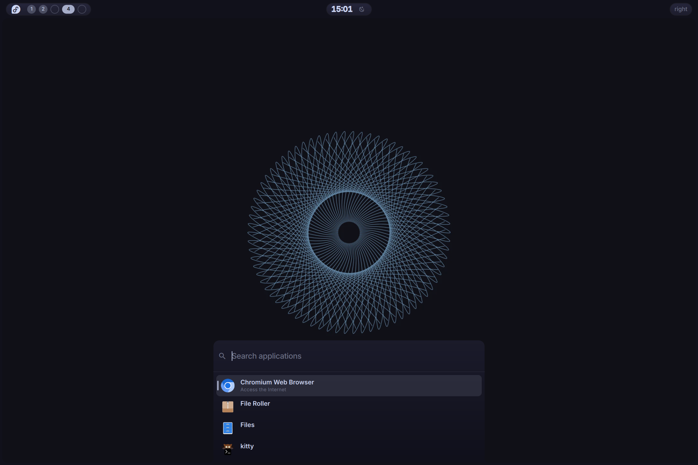
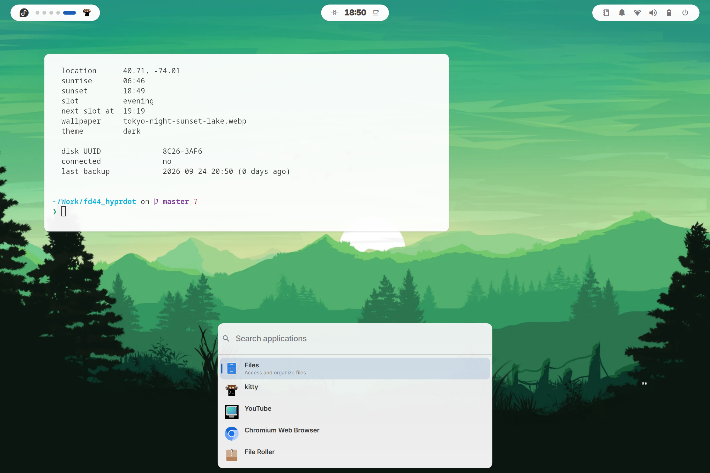

<div align="center">

# fd44_hyprdot

**Fedora 44 · Hyprland · Quickshell** — a complete desktop for the Framework 13 (AMD),
including the installer that builds the machine from bare metal.

<sub>
no display manager &nbsp;·&nbsp; no panel toolkit &nbsp;·&nbsp; no notification daemon &nbsp;·&nbsp; the shell is QML
</sub>

<p>


</p>

</div>

---

## Themes

Two palettes, switched live with `SUPER+T` or the sun/moon beside the clock.
The bar, frame, launcher, power menu, lock screen, kitty, GTK apps and Chromium
all follow — nothing restarts.

<table>
<tr>
<td width="50%" valign="top">

<p align="center"><sub><b>dark</b> — Catppuccin Mocha</sub></p>
</td>
<td width="50%" valign="top">

<p align="center"><sub><b>cream</b> — Rosé Pine Dawn</sub></p>
</td>
</tr>
</table>

A theme is one file of 45 key/value pairs in [`themes/`](themes/). `bin/theme.sh`
reads it and fans the values out to five consumers, each with its own idea of
what a config file is:

| target | mechanism | live? |
|---|---|---|
| quickshell | `Theme.qml` watches a generated palette with `FileView` | yes |
| kitty | generated `theme.conf` + `SIGUSR1` | yes |
| GTK apps | `gsettings`, republished by xdg-desktop-portal | yes |
| Hyprland | `hyprctl eval` — **not** `keyword`, which the Lua parser refuses | yes |
| Chromium | `BrowserThemeColor` policy + `--refresh-platform-policy` | yes |
| hyprlock | generated colour variables it `source`s | next lock |

Adding a third theme means adding a file. Nothing else changes.

## What it gives you

- **Bar** — workspaces, clock, theme toggle, and an OSD that slides out of the
  left pill for volume and brightness
- **Frame** — a 4px border drawn around the whole screen, with concave fillets
  where the panels meet it
- **Launcher** (`SUPER+Space`) — rises out of the bottom frame, fuzzy app search
- **Wallpaper picker** (`SUPER+,`) — a coverflow strip of sheared tiles, with a
  crossfade when a wallpaper is applied
- **Power menu** (`SUPER+M` or the physical power button) — icon-only circles;
  log out, restart and shut down arm on the first press and fire on the second
- **Lock screen** — themed hyprlock, with battery
- **Media keys** — quickshell speaks MPRIS directly, so a media key spawns no
  process at all

## Install

The installer builds the whole machine: Btrfs + systemd-boot, optional LUKS,
Hyprland, quickshell, autologin, Plymouth. It asks for a dotfiles git URL —
give it this repo and the result is this desktop, not a generic one.

```sh
# from a Fedora Workstation live ISO
curl -O http://<host>/install_fedora_v1_11.sh
chmod +x install_fedora_v1_11.sh

./install_fedora_v1_11.sh --check-repos   # resolve every package name, no root
sudo ./install_fedora_v1_11.sh --dry-run  # print every command, change nothing
sudo ./install_fedora_v1_11.sh            # the real thing
```

It finishes with a verification pass — boot entries, fstab, autologin, the
font, the policy directory, the absence of packages that install themselves.
Twenty-eight of them run on a default install; a few more with LUKS or zram.

> **The account ships with the password `changeme`.** This is a public repo, so
> assume everyone knows it. That is safe only because `~/.bash_profile` refuses
> to start a session until the password has been changed. The password is
> deliberately **not** expired: `agetty --autologin` runs `login -f`, and PAM
> rejects an expired password on that path rather than prompting, which leaves
> the machine in a getty respawn loop that never reaches a desktop.

### Testing it without hardware

```sh
sudo dnf install qemu-system-x86-core qemu-img edk2-ovmf qemu-ui-gtk \
                 qemu-device-display-virtio-gpu qemu-device-display-virtio-vga-gl \
                 qemu-device-display-virtio-gpu-gl virglrenderer

install/vm-test.sh /path/to/Fedora-Workstation-Live-*.iso
```

Serves this directory over HTTP so the guest can `curl` the installer at
`10.0.2.2:8000`, and forwards host port 2222 to the guest's ssh. The target disk
is `/dev/vda`. `--reboot` boots the installed disk; `--clean` throws it away.

hyprpaper cannot start on virtio-gpu either, so every VM run also exercises the
swaybg fallback.

### On a machine the installer did not build

`~/.config/hypr`, `~/.config/quickshell` and `~/.config/kitty` are **symlinks**
into this checkout, so edits are live and there is nothing to keep in sync.

```sh
git clone https://github.com/jccl1706/fd44_hyprdot ~/Work/fd44_hyprdot
cd ~/Work/fd44_hyprdot

for d in hypr quickshell kitty; do ln -s "$PWD/$d" ~/.config/$d; done

mkdir -p ~/.config/systemd/user
ln -s "$PWD/systemd/power-mode.service" ~/.config/systemd/user/
systemctl --user daemon-reload && systemctl --user enable --now power-mode.service

sudo dnf install rsms-inter-vf-fonts jetbrains-mono-fonts
sudo bin/install-nerd-font.sh        # installs the copy committed in fonts/
bin/theme.sh restore                 # generate the palette files
```

## Keybindings

| Key | Action |
|---|---|
| `SUPER+Return` | terminal (kitty) |
| `SUPER+B` / `+E` | browser / file manager |
| `SUPER+Space` | app launcher |
| `SUPER+,` | wallpaper picker |
| `SUPER+T` | toggle theme |
| `SUPER+M` | power menu (also the physical power button) |
| `SUPER+W` / `+F` / `+V` / `+P` | close / fullscreen / float / pseudo-tile |
| `SUPER+J` | cycle column width |
| `SUPER+[` / `+]` | consume / expel a window from its column |
| `SUPER+A` | fit all — zoom out to the whole strip |
| `SUPER+arrows` | move focus (`+SHIFT` moves the window) |
| `SUPER+1..0` | focus workspace (`+SHIFT` sends the window) |
| `SUPER+Tab` | next workspace (`+SHIFT` previous) |
| `SUPER+S` | scratchpad (`+SHIFT` send) |
| `SUPER+Escape` | passthrough — hand every key to the focused window, e.g. a VM |
| `Print` | screenshot to clipboard |
| `SUPER+CTRL+P` | screenshot region to `~/Pictures/` |

Volume, brightness and media keys are bound with `locked = true`, so they keep
working on the lock screen.

> `SUPER+Escape` is a submap. While it is active **no other bind exists** — that
> is the point — so a stuck passthrough looks exactly like a broken keyboard.
> `hyprctl submap` says which is active; the same key gets you out.

## Layout

```
hypr/            Hyprland config, in Lua (0.56+)
  hyprland.lua     entry point; requires the modules below
  monitors · look · input · binds · rules · autostart
  hypridle.conf    idle → lock → screen off, AC/battery aware
  hyprlock.conf    lock screen; colours come from the theme

quickshell/      the shell itself, QML
  Theme.qml        SINGLETON — every colour, font and metric
  shell.qml        entry point; one Bar per monitor, IPC, global shortcuts
  Bar · Frame · Launcher · WallpaperPicker · PowerMenu · Osd · Media

themes/          dark.conf, cream.conf — one file per palette
fonts/           Symbols Nerd Font, vendored (MIT)
wallpapers/      resized, webp
bin/             theme.sh · wallpaper.sh · power-mode.sh · idle-action.sh
                 gaming-setup.sh — opt-in, not run by the installer
install/         the installer, and vm-test.sh
```

## Gaming

Not part of the installer, on purpose: Steam is a feature set one machine
wants, not something the base install is broken without. It lives in its own
opt-in script, run by hand on the machine that wants it.

```sh
sudo bin/gaming-setup.sh --dry-run     # print every command, change nothing
sudo bin/gaming-setup.sh               # RPM Fusion, Steam, gamemode, gamescope
sudo bin/gaming-setup.sh --proton-ge   # and the latest GE-Proton
```

It ends with a verification pass that **runs** the tools rather than asking rpm
whether they are installed — which Vulkan driver is actually loaded, whether
the 32-bit ICD is there, whether `gamemoded` starts. It also marks the Steam
library `nodatacow` before Steam's first run, which is the only moment Btrfs
allows it.

It also caps every game run through Proton at 120 fps, inside the translation
layer itself (`VKD3D_FRAME_RATE` for DX12, `DXVK_CONFIG` for DX9/11), from
`~/.config/uwsm/env.d/gaming`. That file is written into the gaming machine's
home, not this repo — the laptop shares the repo and does not game.

## Power policy

| | Battery | AC |
|---|---|---|
| Power profile | `power-saver` | `balanced` |
| Brightness | 50% | 100% |
| Lock | 5:00 | 5:00 |
| Display off | 5:30 | 15:30 |
| Suspend | 15:00 | never (lid close only) |

Locking is not power-dependent; only the display-off timeout is. On AC the
machine stays awake so long downloads and ssh sessions are not cut off — closing
the lid still suspends, via logind's `HandleLidSwitchExternalPower`.

Two independent mechanisms. **Profile and brightness** come from
`bin/power-mode.sh`, driven by `udevadm monitor` on the `power_supply` subsystem
— event-driven, and entirely unprivileged. **Timeouts** live in `hypridle.conf`
with the logic in `bin/idle-action.sh`, where every listener is always armed and
the battery-scoped ones test the power source when they fire.

A machine with **no battery at all** counts as permanently on AC. That is not
pedantry: without it a desktop suspends itself on idle because it cannot find a
battery.

## Editing

```sh
hyprctl reload         # apply
hyprctl configerrors   # ALWAYS check - reload says "ok" even when a module failed
```

`hyprctl dispatch` evaluates **Lua**, not the old string syntax, which makes it
the fastest way to test a dispatcher before binding it:

```sh
hyprctl dispatch 'hl.dsp.window.fullscreen()'
hyprctl eval 'hl.config({ general = { gaps_in = 8 } })'   # for non-dispatchers
```

The authoritative Lua reference is the stub Hyprland ships:
`/usr/share/hypr/stubs/hl.meta.lua` — more complete than the wiki for the Lua
config format.

Quickshell watches its own files and reloads on save. `qs ipc show` lists the IPC
targets; `qs log` is the running instance's log.

## Gotchas

Each of these cost real time, and none produced an error message.

**Hyprland / hyprlang**

- `hyprctl dispatch dpms off` does **not** work on 0.56 — `dispatch` evaluates
  Lua, so the space-separated form is a parse error. It fails *silently* from
  hypridle's side. Nearly every example online uses the broken form.
- `hl.dsp.dpms()` **ignores its argument and toggles.** Two unguarded wake calls
  cancel out and leave the display off, both logging `ok`.
- `hyprctl keyword` is refused outright: *"keyword can't work with non-legacy
  parsers. Use eval."* Use `hyprctl eval` with a real `hl.config{}` call.
- Hyprlang `source` resolves against the **working directory**, not the file
  doing the sourcing, so a relative path silently loads nothing.
- Hyprlang has no statement separator — `;` is read as part of the value.

**Fonts**

- A weight appended to a family name does not resolve. `Inter Variable Bold`
  falls back to **Noto Sans**, silently. Use pango markup for weight.
- Fontconfig prefers `~/.local/share/fonts`, so a hand-placed copy can make a
  machine render perfectly while a fresh install of the same config has no
  glyphs at all. `bin/install-nerd-font.sh` removes the user copy rather than
  adding to it.

**Packaging**

- `nwg-panel` declares `Supplements: hyprland` — the *reverse* of Recommends —
  so it installs itself on every machine and is invisible to any "what pulled
  this in" query. It is excluded by name.
- `--setopt=install_weak_deps=False` is deliberately **never** used: this
  Framework's amdgpu and iwlwifi firmware both arrive only via Recommends, and
  stripping weak deps left the machine unable to load any firmware at all.

**Misc**

- In the test VM, `gl=on` plus `GDK_BACKEND=x11` paints a **black window** from
  the moment Hyprland starts — the guest is fine, qemu just never imports the
  GL scanout through XWayland. The firmware and the Plymouth splash draw
  normally, which makes it look like a boot failure. `vm-test.sh` now keeps the
  window on Wayland whenever 3D is on.
- The kernel truncates process names to 15 characters, so `pgrep -x
  chromium-browser` (16) matches nothing, silently.
- `brightnessctl` needs `-d amdgpu_bl1`, or it also picks up the ChromeOS EC LED
  classes and errors on them.
- Variables that systemd user services need belong in **uwsm's** environment,
  not `autostart.lua` — uwsm exports before Hyprland runs.
- Do not try to dismiss the Plymouth splash from Hyprland. Plymouth holds DRM
  master; masking `plymouth-quit*` deadlocks the boot.

## Not yet done

- The bar's right region is still a placeholder — no battery, network or tray.
- No notification daemon, so apps that send notifications get silence.
- Nothing indicates when the `passthrough` submap is active.
